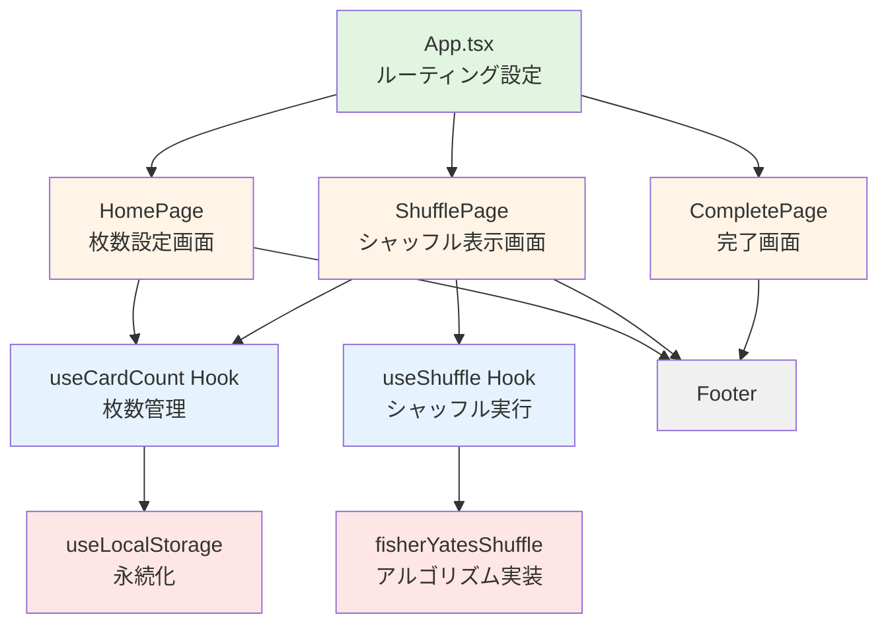

# Design Document

## Overview

Perfect Shuffleは、React + TypeScript + Vite + Tailwind CSSで構築される単一ページアプリケーション（SPA）です。シンプルな3画面構成（枚数設定 → シャッフル表示 → 完了）で、カードゲームプレイヤーが物理的なカードを公平にシャッフルするための指示を提供します。

技術スタック：
- **フロントエンド**: React 18+ with TypeScript
- **ビルドツール**: Vite
- **スタイリング**: Tailwind CSS
- **ルーティング**: React Router v6
- **状態管理**: React Context API + LocalStorage
- **静的解析/フォーマット**: Biome
- **テスト**: Vitest + React Testing Library

## Steering Document Alignment

### Technical Standards (tech.md)

steering/tech.mdが存在しないため、本プロジェクトの技術標準を以下に定義します：

- **TypeScript厳格モード**: `strict: true`を有効化し、型安全性を確保
- **コンポーネント設計**: 関数コンポーネント + フックベースの実装
- **コード品質**: Biome による静的解析とフォーマット
- **ファイル構成**: 機能ベースのディレクトリ構造（features配下に機能単位で配置）

### Project Structure (structure.md)

steering/structure.mdが存在しないため、以下のプロジェクト構造を定義します：

```
perfect-shuffle/
├── src/
│   ├── features/           # 機能単位のディレクトリ
│   │   ├── card-setup/    # カード枚数設定機能
│   │   │   ├── components/
│   │   │   │   ├── CardCountSelector.tsx
│   │   │   │   └── QuickSelectButtons.tsx
│   │   │   ├── hooks/
│   │   │   │   └── useCardCount.ts
│   │   │   └── HomePage.tsx
│   │   ├── shuffle/       # シャッフル機能
│   │   │   ├── components/
│   │   │   │   ├── ShuffleDisplay.tsx
│   │   │   │   └── ProgressIndicator.tsx
│   │   │   ├── hooks/
│   │   │   │   └── useShuffle.ts
│   │   │   └── ShufflePage.tsx
│   │   └── complete/      # 完了画面機能
│   │       └── CompletePage.tsx
│   ├── shared/            # 共有コンポーネント・ユーティリティ
│   │   ├── components/
│   │   │   └── Footer.tsx
│   │   ├── hooks/
│   │   │   └── useLocalStorage.ts
│   │   └── utils/
│   │       ├── fisherYatesShuffle.ts
│   │       └── validateCardCount.ts
│   ├── types/             # TypeScript型定義
│   │   └── index.ts
│   ├── App.tsx            # ルートコンポーネント
│   └── main.tsx           # エントリーポイント
├── public/                # 静的ファイル
└── tests/                 # テストファイル
```

## Code Reuse Analysis

### Existing Components to Leverage

新規プロジェクトのため、既存コンポーネントは存在しません。ただし、以下のReactエコシステムのライブラリを活用します：

- **React Router**: 画面遷移とナビゲーション管理
- **Tailwind CSS**: ユーティリティファーストのスタイリング

### Integration Points

- **LocalStorage API**: ブラウザ標準のWeb Storage APIを使用してカード枚数を永続化
- **フィッシャー-イェーツアルゴリズム**: 標準的なシャッフルアルゴリズムを自前実装

## Architecture

Perfect Shuffleは、シンプルなクライアントサイドのみのアーキテクチャを採用します。

### Modular Design Principles

- **Single File Responsibility**: 各ファイルは単一の責務を持つ（例: HomePage.tsx は枚数設定のみ、shuffle.ts はシャッフルロジックのみ）
- **Component Isolation**: 画面コンポーネント（Pages）と再利用可能なコンポーネント（Components）を明確に分離
- **Service Layer Separation**: ビジネスロジック（utils）、状態管理（hooks）、表示（components/pages）を分離
- **Utility Modularity**: シャッフルアルゴリズムとLocalStorage操作を独立したモジュールとして実装
- **Feature-Based Organization**: 機能ごとにディレクトリを分割し、関連するコンポーネント・フックをまとめて管理

### Architecture Diagram



## Components and Interfaces

### Page Components

#### HomePage (features/card-setup/HomePage.tsx)
- **Purpose:** カード枚数の設定とシャッフル開始
- **Props:** なし（Context経由で状態を取得）
- **State:**
  - `cardCount: number` - 現在設定中の枚数
- **Interfaces:**
  - ユーザー入力: +/- ボタン、クイック選択ボタン（40/60/99）
  - スタートボタン: LocalStorageに保存して `/shuffle` に遷移
- **Dependencies:** `useCardCount`, `useNavigate`

#### ShufflePage (features/shuffle/ShufflePage.tsx)
- **Purpose:** シャッフル順序を1枚ずつ表示
- **Props:** なし（Context経由で状態を取得）
- **State:**
  - `shuffledOrder: number[]` - シャッフル結果の配列
  - `currentIndex: number` - 現在表示中のインデックス
- **Interfaces:**
  - 画面タップ/クリック: 次のカードに進む
  - 中断ボタン: ホームに戻る
- **Dependencies:** `useShuffle`, `useNavigate`
- **Reuses:** Fisher-Yates シャッフルアルゴリズム

#### CompletePage (features/complete/CompletePage.tsx)
- **Purpose:** シャッフル完了の通知
- **Props:** なし
- **State:** なし
- **Interfaces:**
  - ホームに戻るボタン: `/` に遷移
- **Dependencies:** `useNavigate`

### Feature-Specific Components

#### CardCountSelector (features/card-setup/components/CardCountSelector.tsx)
- **Purpose:** カード枚数の増減操作UI
- **Props:**
  - `count: number` - 現在の枚数
  - `onIncrement: () => void` - +ボタンのハンドラ
  - `onDecrement: () => void` - -ボタンのハンドラ
- **Dependencies:** なし

#### QuickSelectButtons (features/card-setup/components/QuickSelectButtons.tsx)
- **Purpose:** 40/60/99のクイック選択ボタン
- **Props:**
  - `onSelect: (count: number) => void` - 選択時のハンドラ
- **Dependencies:** なし

#### ShuffleDisplay (features/shuffle/components/ShuffleDisplay.tsx)
- **Purpose:** 「上から○枚目を置いて」のメイン表示
- **Props:**
  - `cardPosition: number` - 表示するカード位置（現在の手札での位置）
  - `onClick: () => void` - タップ/クリックハンドラ
- **Dependencies:** なし

**表示する数字の決定ロジック（具体例）:**

例: 10枚でシャッフルした場合
- 元の順序: `[1,2,3,4,5,6,7,8,9,10]`
- シャッフル後: `[4,1,7,2,8,3,6,9,10,5]` （フィッシャー-イェーツの結果）

このシャッフル結果を実現するために、ユーザーは以下の順序でカードを置いていきます：

**1回目:**
- シャッフル後[0] = 4 → 元の4枚目が新しい束の一番下に来る
- 残りカード: `[1,2,3,4,5,6,7,8,9,10]`
- 4を探す → 現在の手札で**4枚目**
- 表示: **「上から4枚目を置いて」**
- 4を置いた後の残り: `[1,2,3,5,6,7,8,9,10]`

**2回目:**
- シャッフル後[1] = 1 → 元の1枚目
- 残りカード: `[1,2,3,5,6,7,8,9,10]`
- 1を探す → 現在の手札で**1枚目**
- 表示: **「上から1枚目を置いて」**
- 置いた後の残り: `[2,3,5,6,7,8,9,10]`

**3回目:**
- シャッフル後[2] = 7 → 元の7枚目
- 残りカード: `[2,3,5,6,7,8,9,10]`
- 7を探す → 現在の手札で**5枚目**（1と4は既に置いたため）
- 表示: **「上から5枚目を置いて」**
- 置いた後の残り: `[2,3,5,6,8,9,10]`

**4回目:**
- シャッフル後[3] = 2 → 元の2枚目
- 残りカード: `[2,3,5,6,8,9,10]`
- 2を探す → 現在の手札で**1枚目**
- 表示: **「上から1枚目を置いて」**

...このように10回繰り返す

**実装アルゴリズム:**
```typescript
// 初期状態
const shuffledOrder = [4,1,7,2,8,3,6,9,10,5]; // フィッシャー-イェーツの結果
const remainingCards = [1,2,3,4,5,6,7,8,9,10]; // 残りのカード

// 各ステップで
for (let i = 0; i < shuffledOrder.length; i++) {
  const targetCard = shuffledOrder[i]; // 次に置くべき元の位置
  const currentPosition = remainingCards.indexOf(targetCard); // 残りの中での位置（0-indexed）
  const displayPosition = currentPosition + 1; // 1-indexedに変換

  // 表示: 「上から{displayPosition}枚目を置いて」

  // カードを置いたので残りから削除
  remainingCards.splice(currentPosition, 1);
}
```

#### ProgressIndicator (features/shuffle/components/ProgressIndicator.tsx)
- **Purpose:** 進捗表示（X/N）
- **Props:**
  - `current: number` - 現在の番号
  - `total: number` - 総枚数
- **Dependencies:** なし

### Shared Components

#### Footer (shared/components/Footer.tsx)
- **Purpose:** 全画面共通のフッター表示
- **Props:** なし
- **Interfaces:**
  - Privacy Policyリンク（href="#"）
  - 著作権表示
- **Dependencies:** なし
- **Styling:** 固定位置（bottom）配置

### Custom Hooks

#### useCardCount (features/card-setup/hooks/useCardCount.ts)
- **Purpose:** カード枚数の状態管理とLocalStorage連携
- **Return Type:**
```typescript
{
  cardCount: number;
  setCardCount: (count: number) => void;
  increment: () => void;
  decrement: () => void;
  setQuickSelect: (count: number) => void;
  saveCardCount: () => void;
}
```
- **Dependencies:** `useLocalStorage`

#### useShuffle (features/shuffle/hooks/useShuffle.ts)
- **Purpose:** シャッフル実行と順序管理
- **Parameters:** `cardCount: number`
- **Return Type:**
```typescript
{
  shuffledOrder: number[];
  currentIndex: number;
  currentCardPosition: number;
  progress: { current: number; total: number };
  nextCard: () => void;
  isComplete: boolean;
}
```
- **Dependencies:** `fisherYatesShuffle`

#### useLocalStorage (shared/hooks/useLocalStorage.ts)
- **Purpose:** LocalStorageの読み書きを抽象化
- **Parameters:**
  - `key: string` - Storageのキー
  - `initialValue: T` - デフォルト値
- **Return Type:**
```typescript
[T, (value: T) => void]
```
- **Dependencies:** なし

## Data Models

### CardCount (Type)
```typescript
type CardCount = number;

// Validation constraints
const MIN_CARD_COUNT = 1;
const MAX_CARD_COUNT = 99;
const DEFAULT_CARD_COUNT = 60;
const QUICK_SELECT_OPTIONS = [40, 60, 99] as const;
```

### ShuffleResult (Type)
```typescript
interface ShuffleResult {
  // シャッフル後の各位置に配置されるカードの元の位置（1-indexed）
  order: number[];

  // シャッフル実行時刻（デバッグ用）
  timestamp: Date;
}
```

### ShuffleState (Context State)
```typescript
interface ShuffleState {
  cardCount: number;
  shuffleResult: ShuffleResult | null;
}
```

### LocalStorage Schema
```typescript
// Key: 'perfect-shuffle-card-count'
// Value: number (1-99)
{
  "perfect-shuffle-card-count": 60
}
```

## Utility Functions

### fisherYatesShuffle (shared/utils/fisherYatesShuffle.ts)
```typescript
/**
 * フィッシャー-イェーツアルゴリズムでシャッフルした順序を返す
 * @param count カードの枚数
 * @returns シャッフル後の各位置に配置されるカードの元の位置（1-indexed）
 */
function fisherYatesShuffle(count: number): number[]
```

**アルゴリズム仕様:**
1. 1からcountまでの配列を作成: `[1, 2, 3, ..., count]`
2. 配列の末尾から開始し、ランダムな位置と交換
3. `Math.random()` を使用してランダムインデックスを生成
4. シャッフル後の配列を返す

### validateCardCount (shared/utils/validateCardCount.ts)
```typescript
/**
 * カード枚数が有効範囲内かを検証
 * @param count 検証する枚数
 * @returns 有効な枚数（無効な場合は60に固定）
 */
function validateCardCount(count: number): number
```

**検証ロジック:**
- 1-99の範囲外、または非数値の場合 → 60を返す
- 1-99の範囲内 → そのまま返す

## Routing

React Router v6を使用した画面遷移：

| Path | Component | Description |
|------|-----------|-------------|
| `/` | HomePage | 枚数設定画面（初期画面） |
| `/shuffle` | ShufflePage | シャッフル順序表示画面 |
| `/complete` | CompletePage | 完了画面 |

**遷移フロー:**
1. `/` (Home) → スタートボタン → `/shuffle`
2. `/shuffle` → すべて表示完了 → `/complete`
3. `/shuffle` → 中断ボタン → `/` (Home)
4. `/complete` → ホームに戻る → `/` (Home)

## Styling Guidelines

### Tailwind CSS Configuration

- **画面幅**: 375px基準（iPhone SE サイズ）
- **フォントサイズ**:
  - タイトル: `text-4xl` (36px)
  - サブタイトル: `text-lg` (18px)
  - カード位置表示: `text-6xl` (60px) または `text-7xl` (72px)
  - 進捗表示: `text-2xl` (24px)
  - 操作ガイド: `text-base` (16px)
- **カラーパレット**:
  - Primary: `blue-600` (ボタン、アクセント)
  - Background: `gray-50` (背景)
  - Text: `gray-900` (メインテキスト)
  - Border: `gray-300` (ボーダー)
- **タッチターゲット**: 最小 `h-11 w-11` (44px)
- **スペーシング**: 統一的な間隔（`space-y-4`, `p-6` など）

### Component-Specific Styling

#### HomePage
- 垂直センタリング: `flex flex-col items-center justify-center min-h-screen`
- 枚数表示: 大きくて見やすい `text-5xl font-bold`
- ボタン配置: `+`/`-` は横並び、クイック選択は3列グリッド

#### ShufflePage
- カード位置: 画面中央に超大きく表示 `text-7xl font-extrabold`
- 進捗表示: 右上または上部中央に配置
- タップエリア: 画面全体をクリッカブルに
- 中断ボタン: 左上に小さく配置

#### CompletePage
- 完了メッセージ: 中央に大きく表示
- ボタン: 中央下部に配置

#### Footer
- 固定位置: `fixed bottom-0 w-full`
- 背景: `bg-white` with `shadow-md`
- 高さ: `h-16`
- 要素配置: flex で左右に分散配置

## Error Handling

### Error Scenarios

#### 1. LocalStorage利用不可
- **Handling:** try-catchでラップし、エラー時はメモリ上の状態のみで動作
- **User Impact:** デフォルト値（60枚）で動作するが、次回訪問時に設定が保持されない
- **Implementation:** `useLocalStorage` フック内でフォールバック処理

#### 2. 無効なカード枚数入力
- **Handling:** `validateCardCount` 関数で60枚に固定
- **User Impact:** 自動的に60枚に補正され、エラーは表示されない
- **Implementation:** 入力変更時に自動検証

#### 3. シャッフル中のナビゲーション離脱
- **Handling:** 状態をクリアせず、戻った際に継続可能にする（オプション: 将来実装）
- **User Impact:** 現在の仕様では中断ボタンでのみホームに戻れる
- **Implementation:** React Routerの`beforeunload`イベント（将来の拡張）

#### 4. Math.random() の偏り
- **Handling:** フィッシャー-イェーツアルゴリズムで数学的に公平性を保証
- **User Impact:** なし（アルゴリズムレベルで対処）
- **Implementation:** 標準実装を使用

## Testing Strategy

### Unit Testing

**テスト対象:**
- `fisherYatesShuffle`: シャッフル結果が有効な順列であることを検証
  - すべての数字が1回ずつ出現するか
  - 配列長が正しいか
  - 100回実行して異なる結果が生成されるか（ランダム性）
- `validateCardCount`: 境界値テスト
  - 0 → 60に補正
  - 100 → 60に補正
  - 50 → 50のまま
  - NaN → 60に補正
- `useLocalStorage`: モックしたStorageでの読み書きテスト

**ツール:** Vitest

### Integration Testing

**テスト対象:**
- カード枚数設定 → LocalStorage保存 → シャッフル実行の一連のフロー
- 画面遷移: Home → Shuffle → Complete → Home
- Context状態の伝播: 枚数設定がShufflePageに正しく渡されるか

**ツール:** React Testing Library + Vitest

### End-to-End Testing

**テストシナリオ:**
1. 初回訪問（デフォルト60枚）→ シャッフル → 完了
2. 枚数変更（+/- ボタン）→ シャッフル → 完了
3. クイック選択（40枚）→ シャッフル → 完了
4. シャッフル中断 → ホームに戻る
5. 再訪問時に前回の枚数が保持されているか

**ツール:** Playwright または Cypress（オプション: 小規模プロジェクトのため省略可）

### Testing Priority

1. **High**: `fisherYatesShuffle`（コアロジック）
2. **High**: `validateCardCount`（データ整合性）
3. **Medium**: カスタムフック（`useCardCount`, `useShuffle`）
4. **Medium**: ページコンポーネントの基本動作
5. **Low**: スタイリング、視覚的な要素

## Performance Considerations

- **シャッフル実行時間**: O(n) の計算量で、99枚でも1ms未満
- **レンダリング最適化**: 不要な再レンダリングを防ぐため、Context値をメモ化
- **LocalStorage**: 同期処理だが、データサイズが小さい（数値1つ）ため影響なし
- **バンドルサイズ**: React Router以外の外部依存なし、軽量に保つ

## Security Considerations

- **XSS対策**: Reactのデフォルトエスケープ機能に依存（`dangerouslySetInnerHTML`は使用しない）
- **LocalStorage**: 個人情報を保存しないため、プライバシーリスクなし
- **CSP**: 将来的にContent Security Policyを設定可能（Viteで対応）

## Accessibility

- **キーボード操作**: ボタンはすべてフォーカス可能
- **スクリーンリーダー**: `aria-label` で適切なラベルを付与
- **コントラスト比**: WCAG AA基準（4.5:1以上）を満たす色選択
- **タッチターゲット**: 最小44pxを確保

## Development Tools

### Biome Configuration

```json
{
  "formatter": {
    "enabled": true,
    "indentStyle": "space",
    "indentWidth": 2,
    "lineWidth": 100
  },
  "linter": {
    "enabled": true,
    "rules": {
      "recommended": true
    }
  },
  "javascript": {
    "formatter": {
      "quoteStyle": "double",
      "trailingComma": "all"
    }
  }
}
```

## Future Enhancements

以下は初期実装には含まれないが、将来的に検討可能な機能：

1. **シャッフル履歴**: 過去のシャッフル結果を保存・閲覧
2. **音声読み上げ**: 「上から12枚目を置いて」を音声で案内
3. **アニメーション**: カード位置の切り替え時にトランジション効果
4. **PWA化**: オフラインでも動作するプログレッシブWebアプリ
5. **多言語対応**: 英語・日本語の切り替え
6. **ダークモード**: 環境に応じたテーマ切り替え
